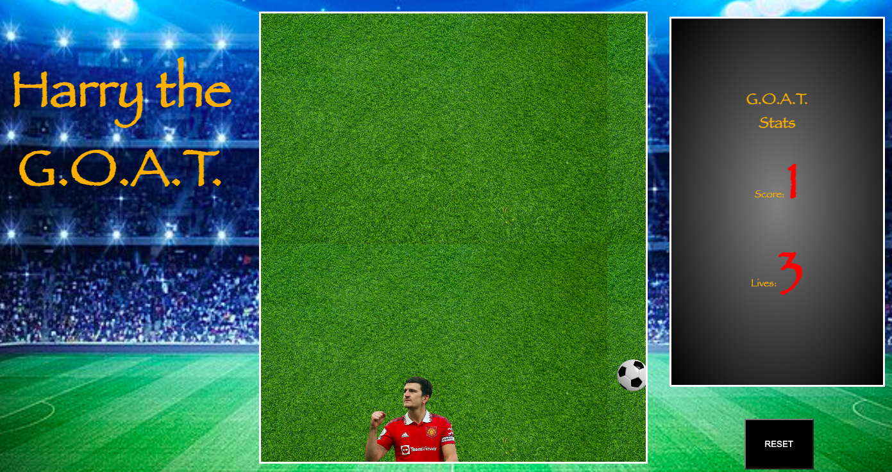
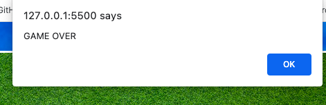

# Harry the G.O.A.T. 

## Overview

Harry the G.O.A.T. is a simple and fun game inspired by Harry Maguire (english football defender). In this game, you control Harry as he "attacks" the goalpost from falling balls. Move Harry left and right to dodge the balls and try to score as many points as possible.

## How to Play

1. Open the `index.html` file in your web browser or visit https://thexishuai.github.io/firstGameProject/ to play.
2. The game will automatically be displayed and working.
3. Use the left and right arrow keys on your keyboard to move Harry horizontally across the screen.
4. Dodge the falling balls by moving Harry out of their path.
5. If a ball hits Harry, one point will be deducted from your lives counter.
6. For every ball that passes the x-axis limit, one point will be added to your score.
6. The game ends when your lives surpasses zero.

## Game Over

This is the game over pop up window.

## Controls

- Left Arrow Key: Move Harry to the left.
- Right Arrow Key: Move Harry to the right.

## Game Mechanics

- Harry's position is limited to the x-axis within the game container.
- Balls fall randomly from the top of the screen at regular intervals.
- When a ball collides with Harry, one life is deducted, and the ball disappears.
- When a ball passes the x-axis limit without hitting Harry, one point is added to the score, and the ball disappears.
- The game displays the current score and the number of lives remaining in G.O.A.T. Stats, on the right side.

## Development

The game is developed using HTML, CSS and JavaScript.

- `index.html`: The main HTML file containing the game layout and elements.
- `style.css`: The CSS file for styling the game layout and player.
- `JS/player.js`: JavaScript file containing the Player class to manage Harry's movements; setting inside thewidth ,x axis and left in order to move the player side to side.
- `JS/game.js`: JavaScript file containing the Game class to manage game elements and mechanics; set inside we have the rest of the game features needed. Lives and score, obstacles, #gameContainer, buttonContainerElement and gameIsOver.
- `JS/script.js`: JavaScript file with game event listeners and functions. variables are created to store both classes,Game and Player. All the game JS code is written here.

## JS code structure to take in account

Player movement:

collision detection:

## Dependencies

- No external libraries or frameworks are used in this game.

## Author

- This game is created and developed by Hector Martin Benito , TheXiShuai (Github account).
